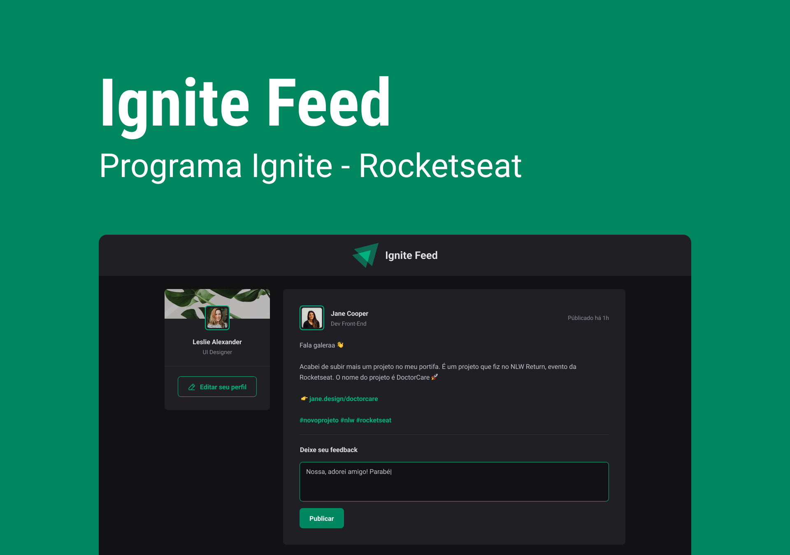

<h1 align="center">
     📩 <a href="#" alt="sistema web igniteFeed"> Ignite Feed </a>
</h1>

<h3 align="center">
    ✔ Projeto Ignite Feed. Aplicação para simular um feed de uma rede social.✉
</h3>

<h4 align="center">
	🚧 Concluído 🚀 🚧
</h4>

Tabela de conteúdos
=================
<!--ts-->
   * [Sobre o projeto](#-sobre-o-projeto)
   * [Funcionalidades](#-funcionalidades)
   * [Layout](#-layout)
     * [Web](#web)
     * [Mobile](#mobile)     
   * [Como executar o projeto](#-baixando-e-executando)
   * [Tecnologias](#-tecnologias)
   * [Como contribuir no projeto](#-como-contribuir-no-projeto)
   * [Autor](#-autor)
<!--te-->

## 💻 Sobre o projeto
📩 Ignite Feed - é uma aplicação para simular um feed de uma rede social na criação de comentários e publicações.

Projeto desenvolvido durante a especialiação da [Rocketseat](https://www.rocketseat.com.br/) em React.
A Rocketseat é uma plataforma de educação em tecnologia profinalizante, onde você encontra tudo o que precisa para progredir na programação e alcançar seus objetivos no menor tempo possível

---

## ⚙️ Funcionalidades

- [x] Os usuários tem acesso ao sistema, onde podem:
  - [x] adicionar novos comentários
  - [x] remover comentários
  - [x] curtir comentários

---
## 🎨 Layout
O layout da aplicação está disponível no Figma:
Por conta do sistema ser responsível, o mesmo adaptabilidade para diferentes tamanhos de interface.

### Web
<p align="center">
  
</p>

### Mobile

<p align="center">
  
 
</p>

---

## 🛠 Tecnologias
As seguintes ferramentas foram usadas na constução do projeto:
- [TypeScript]
- [React]
- [HTML e CSS]
- [Vite]

---

## 🧭 Baixando e executando

Antes de começar, você vai precisar ter instalado em sua máquina as seguintes ferramentas:
[Git](https://git-scm.com), [Node.js](https://nodejs.org/en/). 
Além disto é bom ter um editor para trabalhar com o código como [VSCode](https://code.visualstudio.com/)

```bash

# Clone este repositório
$ git clone https://github.com/mguibtech/ignite-feed-tsx.git

# Acesse a pasta do projeto no terminal/cmd
$ cd ignite-feed-ts

# Instale as dependências
$ npm install
ou
$ npm i

# Execute a aplicação em modo de desenvolvimento
$ npm run dev

```
---

## 💪 Como contribuir no projeto

1. Faça um **fork** do projeto.
2. Crie uma nova branch com as suas alterações: `git checkout -b my-feature`
3. Salve as alterações e crie uma mensagem de commit contando o que você fez: `git commit -m "feature: My new feature"`
4. Envie as suas alterações: `git push origin my-feature`
> Caso tenha alguma dúvida confira este [guia de como contribuir no GitHub](https://medium.com/@lcnogueira/um-guia-para-contribui%C3%A7%C3%A3o-em-projetos-open-source-no-github-46a423e4e9b3)

---

### 🦸 Autor


<a href="https://www.linkedin.com/in/marcos-guibson-santos-da-silva-0b62321a3/">
 
 <br />
 <sub><b>Marcos Guibson</b></sub></a> <a href="https://www.linkedin.com/in/marcos-guibson-santos-da-silva-0b62321a3/" title="mguibtech">🚀</a>

Feito com ❤️ por Marcos Guibson 👋🏽 Entre em contato!

[](https://www.linkedin.com/in/marcos-guibson-santos-da-silva-0b62321a3/) 
[](mailto:mguibtech@gmail.com)

